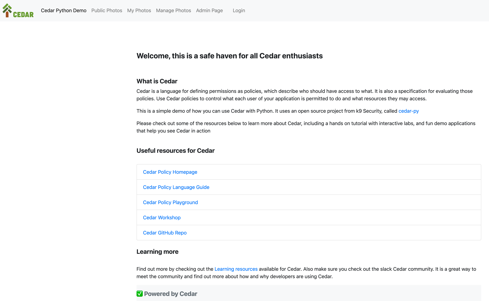

# cedar-flask-demo

A very simple demo to show how you can use Cedar in Python, with a simple Flask based web application. This code is illustrative and verbose to help explain and show how Cedar works.

**Updated June 2024**

Now includes Cedarypy 1.41, improved Cedar logging that shows policy invoked, and updated entities/schema with new context

This repo contains the following demo sample app.

```
├── README.md
└── flask-demo
    ├── app.py
    ├── cedarentities.json
    ├── policies.cedar
    ├── protected
    │   └── images
    │       ├── pic-1.jpg
    │       ├── pic-2.jpg
    │       └── pic-3.jpg
    ├── requirements.txt
    ├── cedarschema.json
    ├── static
    │   └── images
    │       └── cedar-green.png
    ├── templates
    │   ├── admin.html
    │   ├── base.html
    │   ├── denied.html
    │   ├── index.html
    │   ├── login.html
    │   ├── photos-manage.html
    │   ├── photos.html
    │   └── public-photos.html
    └── users.dat
```

This demo would not be possible without the excellent work of **Stephen Kuenzli** and his [cedar-py library](https://github.com/k9securityio/cedar-py)

**Installation**

First make sure you have a version of Python greater than 3.9. When I built this I was using 3.10.11, but I have also used version 3.9.3 on my AWS Cloud9 environment. I followed [this guide](https://repost.aws/questions/QU14iutbqtSsm1gHwQwt02pA/upgrade-to-python-3-9-on-cloud-9) to help me deploy pyenv.

To get this up and running, first create a virtual Python environment

```
python -m venv cedar-demo
source cedar-demo/bin/activate
cd cedar-demo
```

Check out the code

```
git clone https://github.com/094459/cedar-flask-demo.git
```

Install dependencies

```
cd cedar-flask-demo/flask-demo
pip install -r requirements.txt
```

You should now be able to start the application

```
python app.py
```

Opening a browser at http://localhost:8080 should bring up the Flask app. To login, check out the users.dat file for sample users.




